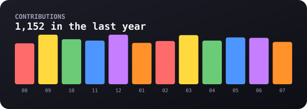
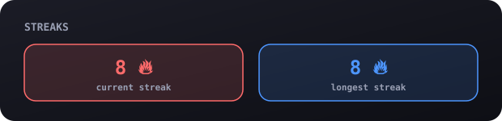
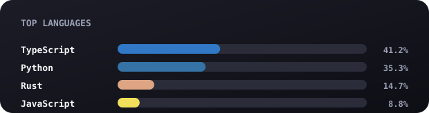

# 👋 Hey, I'm YOUR_NAME

**your one-line tagline goes here — what you build, what you're into**

[🌐 website](https://your-site.com) &nbsp;·&nbsp;
[💼 linkedin](https://linkedin.com/in/yourhandle) &nbsp;·&nbsp;
[📸 instagram](https://instagram.com/yourhandle) &nbsp;·&nbsp;
[✉️ email](mailto:you@example.com)

 

### 🧠 about me

> A couple of sentences about who you are — student / role, where you're
> based, what kind of problems you like to work on.

I build fast, ship, and iterate on real feedback. Right now I'm working on
**[project-name](https://github.com/YOUR_USERNAME/project-name)** — a short
description of what it does. Also into TOPIC_1, TOPIC_2, TOPIC_3.

 

### 🛠️ stack

`python` &nbsp;`typescript` &nbsp;`javascript` &nbsp;`react` &nbsp;`node` &nbsp;`postgres` &nbsp;`docker`

 

### 🚀 projects

| project | stack | what it does |
|---|---|---|
| **[project-one](https://github.com/YOUR_USERNAME/project-one)** | `typescript` | one-line description |
| **[project-two](https://github.com/YOUR_USERNAME/project-two)** | `python` | one-line description |
| **[project-three](https://github.com/YOUR_USERNAME/project-three)** | `react`, `three.js` | one-line description |

 

### 📊 stats

 

the graphics above regenerate daily via <a href="./.github/workflows/stats.yml">a scheduled GitHub Action</a> — see <a href="./SETUP.md">SETUP.md</a> to make them yours.

