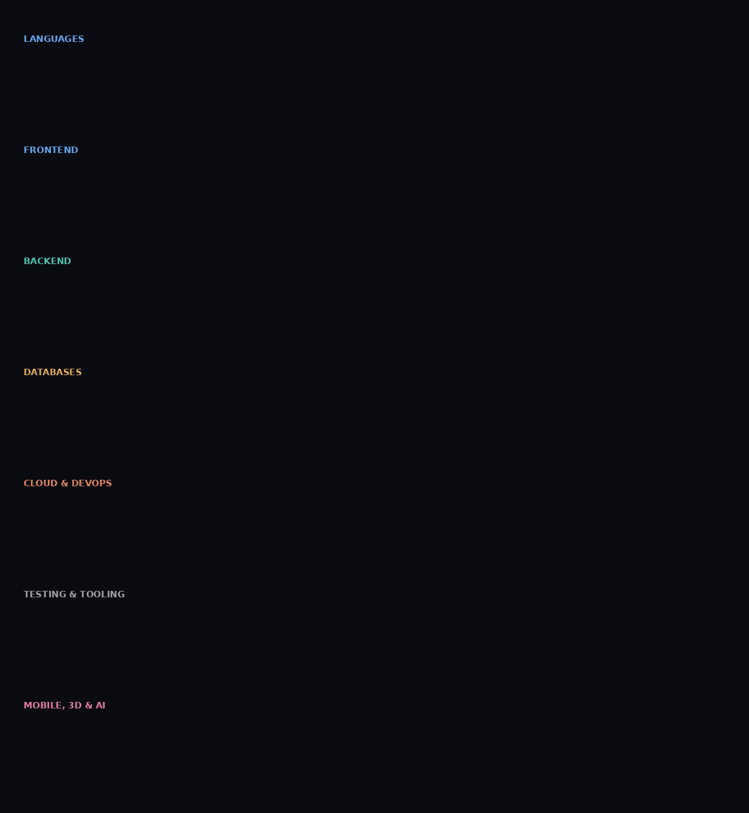
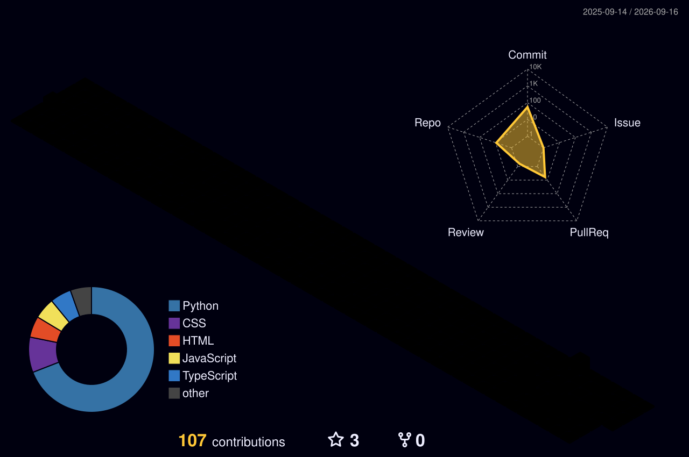

<div align="center">


<table>
  <tr>
    <td align="center">
      <a href="[https://nihalbagul.vercel.app/">
        
      </a>
    </td>
    <td align="center">
      <a href="https://nihalbagul.dev/resume">
        
      </a>
    </td>
  </tr>
  <tr>
    <td align="center">
      <a href="https://linkedin.com/in/nihal-bagul">
        
      </a>
    </td>
    <td align="center">
      <a href="mailto:nihalbagul@gmail.com">
        
      </a>
    </td>
  </tr>
</table>


</div>

<br>

## 🎯 About me

```
┌─────────────────────────────────────────────────────────────────┐
│  🔴  🟡  🟢   nihal@github ~ — zsh
├─────────────────────────────────────────────────────────────────┤
│
│  nihal@github ~ % curl /api/v1/developer/nihalbagul
│
│  HTTP/1.1 200 OK
│  Content-Type: application/json
│
│  {
│    "status":           "available_for_hire 🟢",
│    "name":             "Nihal Bagul",
│    "base":             "India 🇮🇳",
│    "role":             "Full Stack Developer",
│    "education":        "B.Tech ICT — DA-IICT / DAU 🎓",
│    "experience":       "2+ years shipping production apps",
│    "stack": {
│      "frontend":       ["React ⚛️", "Next.js", "TypeScript"],
│      "backend":        ["Node.js", "Express", "GraphQL"],
│      "mobile":         ["Flutter 📱", "React Native", "Dart"],
│      "cloud":          ["AWS ☁️", "Docker 🐳", "Vercel"],
│      "databases":      ["MongoDB", "PostgreSQL"]
│    },
│    "currentlyBuilding": "Something awesome 🚀",
│    "responseTime":     "< 24 hours ⚡",
│    "openToWork":       true,
│    "funFact":          "Turns coffee ☕ into code 💻 ✨"
│  }
│
│  nihal@github ~ % █
└─────────────────────────────────────────────────────────────────┘
```

<br>

## 🛠️ Tech stack





<br>

## 📁 Featured Projects

<div align="center">
  <table width="100%">
    <tr>
      <td width="50%" valign="top">
        <h3>💻 DevConnect</h3>
        <p>A full-stack social network and portfolio builder for developers with real-time messaging, project sharing, and community threads.</p>
        <p>
          
          
          
        </p>
        <a href="https://github.com/nihalbagul/devconnect"><b>🔗 Code Repo</b></a> | <a href="https://devconnect-demo.vercel.app"><b>⚡ Live Demo</b></a>
      </td>
      <td width="50%" valign="top">
        <h3>📱 TaskForge</h3>
        <p>A collaborative productivity and task management app featuring offline synchronization, board views, and real-time push notifications.</p>
        <p>
          
          
          
        </p>
        <a href="https://github.com/nihalbagul/taskforge"><b>🔗 Code Repo</b></a> | <a href="https://taskforge-demo.app"><b>⚡ Live Demo</b></a>
      </td>
    </tr>
  </table>
</div>

<br>

## 📊 GitHub stats

<div align="center">


<br><br>


<br><br>


</div>

<br>

## 🏆 Trophies & platforms

<div align="center">


<br><br>


<br><br>

[](https://www.codechef.com/users/nihal_bagul)
[](https://www.leetcode.com/nihalbagul)
[](https://www.hackerrank.com/nihalbagul98)
[](https://codeforces.com/profile/nihalbagul)
[](https://auth.geeksforgeeks.org/user/nihalbagul98)

</div>

<br>

## ⚡ Recent Activity

<!--START_SECTION:activity-->
<!--END_SECTION:activity-->

<br>

## 🌟 Connect

<div align="center">

[](https://twitter.com/bagul_nihal)
[](https://instagram.com/nihalbagul0812)
[](https://medium.com/@nihalbagul)
[](https://dev.to/nihalbagul)

</div>

<br>

<!--START_SECTION:tictactoe-->
<div align="center">

<h3>🎮 Play Tic-Tac-Toe</h3>
<h4>Your Turn (Play as X)</h4>
<p>Click any empty square below to make a move!</p>
<table style="border-collapse: collapse; text-align: center; font-size: 24px; font-weight: bold;">
  <tr>
    <td width="60" height="60" style="border: 2px solid #414868; text-align: center;"><a href="https://github.com/nihalbagul/nihalbagul/issues/new?title=ttt_move_0_0&body=Click+Submit+New+Issue+to+make+your+move+at+(0,0)!">&nbsp;&nbsp;&nbsp;&nbsp;</a></td>
    <td width="60" height="60" style="border: 2px solid #414868; text-align: center;"><a href="https://github.com/nihalbagul/nihalbagul/issues/new?title=ttt_move_0_1&body=Click+Submit+New+Issue+to+make+your+move+at+(0,1)!">&nbsp;&nbsp;&nbsp;&nbsp;</a></td>
    <td width="60" height="60" style="border: 2px solid #414868; text-align: center;"><a href="https://github.com/nihalbagul/nihalbagul/issues/new?title=ttt_move_0_2&body=Click+Submit+New+Issue+to+make+your+move+at+(0,2)!">&nbsp;&nbsp;&nbsp;&nbsp;</a></td>
  </tr>
  <tr>
    <td width="60" height="60" style="border: 2px solid #414868; text-align: center;"><a href="https://github.com/nihalbagul/nihalbagul/issues/new?title=ttt_move_1_0&body=Click+Submit+New+Issue+to+make+your+move+at+(1,0)!">&nbsp;&nbsp;&nbsp;&nbsp;</a></td>
    <td width="60" height="60" style="border: 2px solid #414868; text-align: center;"><a href="https://github.com/nihalbagul/nihalbagul/issues/new?title=ttt_move_1_1&body=Click+Submit+New+Issue+to+make+your+move+at+(1,1)!">&nbsp;&nbsp;&nbsp;&nbsp;</a></td>
    <td width="60" height="60" style="border: 2px solid #414868; text-align: center;"><a href="https://github.com/nihalbagul/nihalbagul/issues/new?title=ttt_move_1_2&body=Click+Submit+New+Issue+to+make+your+move+at+(1,2)!">&nbsp;&nbsp;&nbsp;&nbsp;</a></td>
  </tr>
  <tr>
    <td width="60" height="60" style="border: 2px solid #414868; text-align: center;"><a href="https://github.com/nihalbagul/nihalbagul/issues/new?title=ttt_move_2_0&body=Click+Submit+New+Issue+to+make+your+move+at+(2,0)!">&nbsp;&nbsp;&nbsp;&nbsp;</a></td>
    <td width="60" height="60" style="border: 2px solid #414868; text-align: center;"><a href="https://github.com/nihalbagul/nihalbagul/issues/new?title=ttt_move_2_1&body=Click+Submit+New+Issue+to+make+your+move+at+(2,1)!">&nbsp;&nbsp;&nbsp;&nbsp;</a></td>
    <td width="60" height="60" style="border: 2px solid #414868; text-align: center;"><a href="https://github.com/nihalbagul/nihalbagul/issues/new?title=ttt_move_2_2&body=Click+Submit+New+Issue+to+make+your+move+at+(2,2)!">&nbsp;&nbsp;&nbsp;&nbsp;</a></td>
  </tr>
</table>

</div>
<!--END_SECTION:tictactoe-->

<br>

<div align="center">


<br><br>

🐍 <b>Contribution snake</b>

<picture>
  <source media="(prefers-color-scheme: dark)" srcset="https://raw.githubusercontent.com/nihalbagul/nihalbagul/output/github-contribution-grid-snake-dark.svg" />
  <source media="(prefers-color-scheme: light)" srcset="https://raw.githubusercontent.com/nihalbagul/nihalbagul/output/github-contribution-grid-snake.svg" />
  
</picture>

<br><br>

🏔️ <b>3D Contribution skyline</b>

<br><br>



<br><br>

⭐️ from [nihalbagul](https://github.com/nihalbagul) — made with 💜 and lots of ☕

<br><br>


</div>
